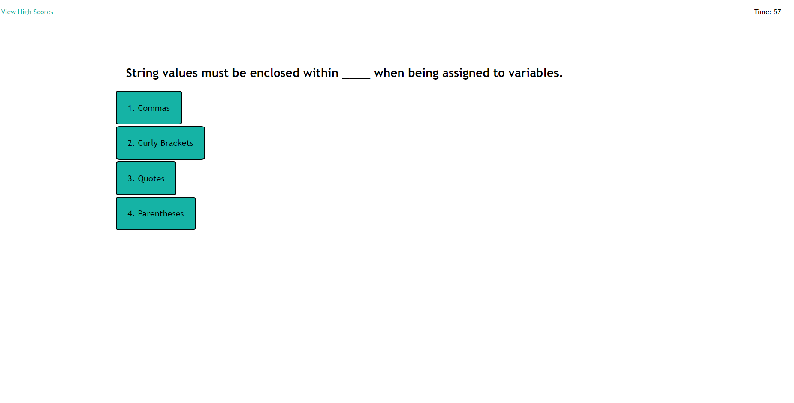

# JavaScript Quiz Challenge

## Description

Click the button to start the quiz, or click the link to view the scores stored in the browser's local storage.You will be given four multiple choice answers for each question. Answer correctly and earn points based partly on the time left remaining. Incorrect answers will deduct time left to complete the quiz. Enter your initials after completion and see the scores.

## Screenshot

Below is a screenshot of what the generator will do with 12 characters of all types selected.

## Usage

Go to the page: https://eljayman.github.io/04-web-APIs-challenge/

Simply click the button and try to answer correctly.

## License

MIT license.
